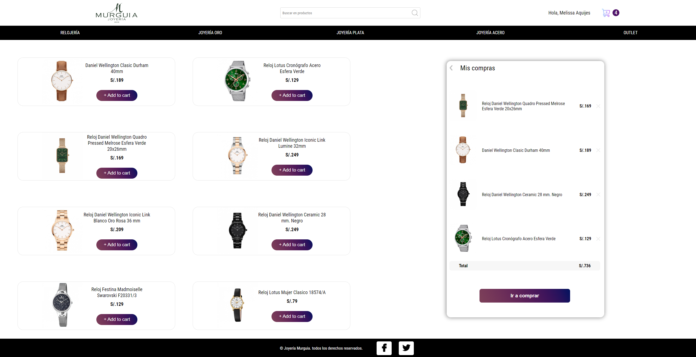
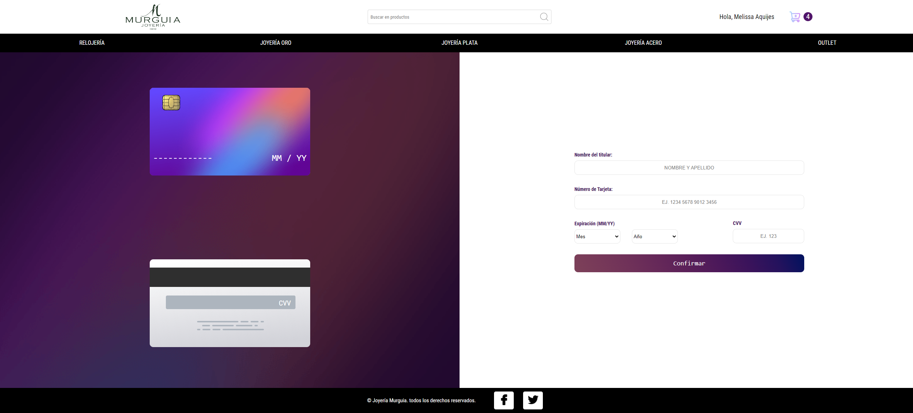
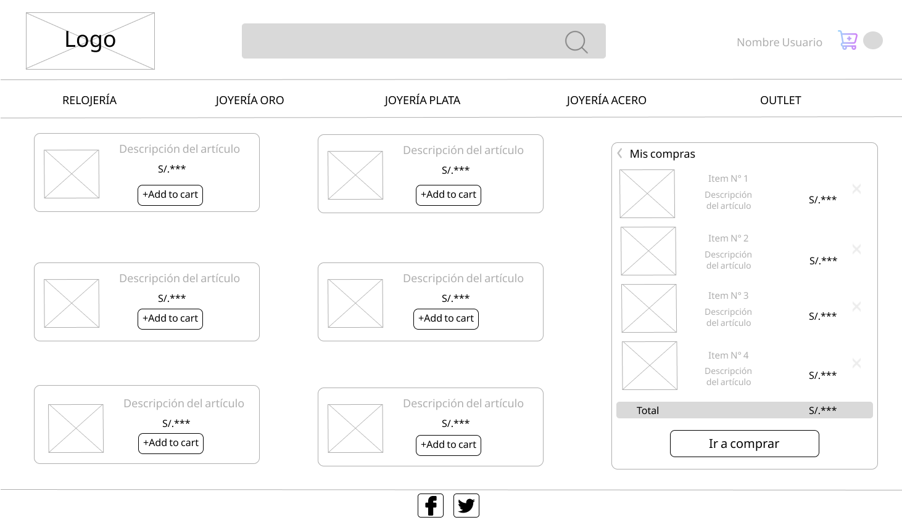
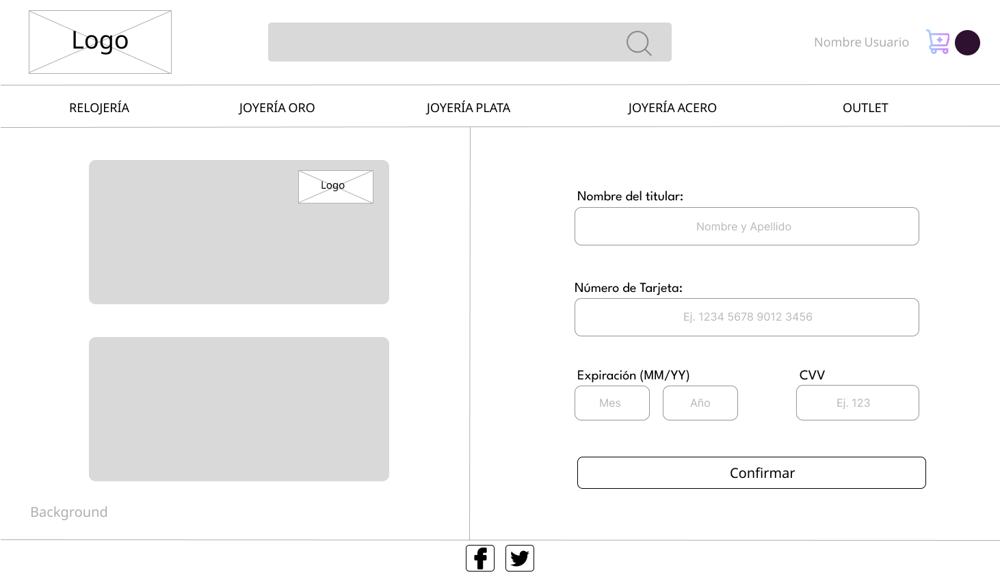

# Tarjeta de crédito válida

## Índice

* [1. Introducción](#1-introducción)
* [2. Funcionalidad](#2-funcionalidad)
* [3. Decisiones de diseño](#3-decisiones-de-diseño)

## 1. Introducción

En este proyecto se construyó una aplicación web para una Tienda de Funkos que al momento de realizar el
pago de dicha compra se validará el número de la tarjeta de crédito mediante el uso del algoritmo de 
Luhn.

La primera página cuenta con una lista de productos, que se puede añadir al carrito y realizar dicha compra que
nos llevará a una página para pagar, donde estará nuestra tarjeta de crédito virtual que contendrá
todas nuestras funciones de interacción para el usuario.

## 2. Funcionalidad

Esta página tiene como funcionalidades:

* Actualizaciones dinámicas a una tarjeta de crédito virtual a medida que el usuario escribe su nombre,
número de tarjeta, mes, año y cvv o cvc.
* Ocultar todos los dígitos de una tarjeta menos los últimos cuatro.
* No permite ingresar al tener un campo vacío.
* Mostrar la franquicia de la tarjeta (Logo de Visa o Mastercard).
* No permite ingresar números en donde el usuario ingresa el nombre y apellido.
* No permite espacios en blanco, letras y/o caracteres en donde el usuario ingresa el número de tarjeta.
* No permite espacios en blanco, letras y/o caracteres en donde el usuario ingresa su cvv o cvc.
* Sólo permite ingresar 3 dígitos en el cvv o cvc.
* Muestra un mensaje si el número de tarjeta brindad es válida o no.
  

## 3. Decisiones de Diseño

Se realizó un prototipo de baja fidelidad y mediante ello se paso a ejecutar la creación de la página.

